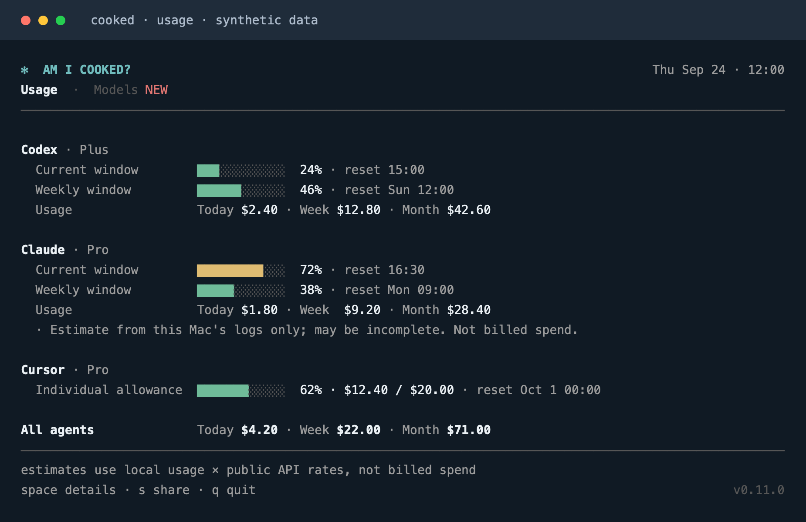
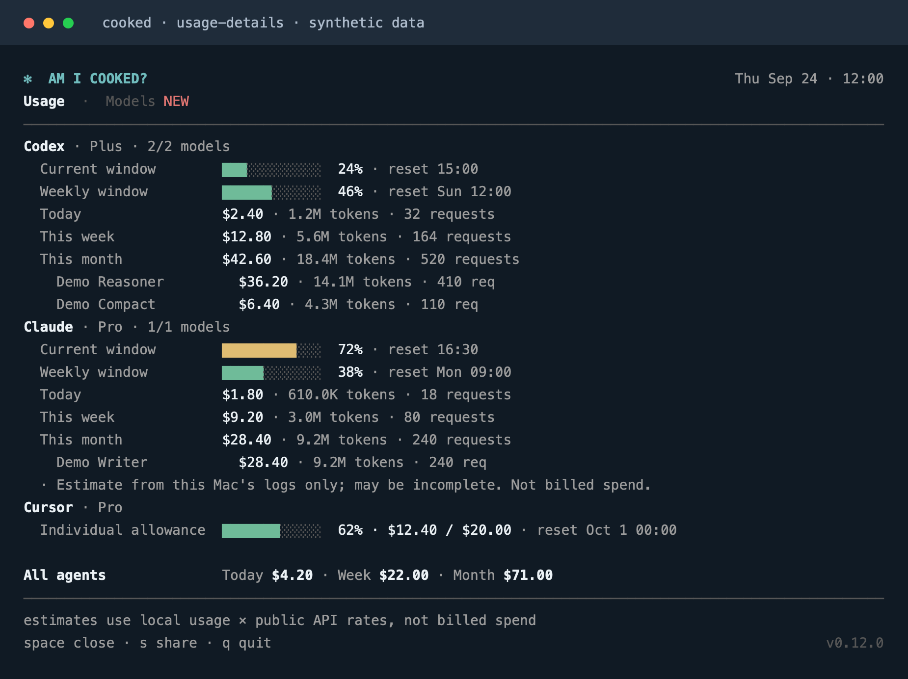
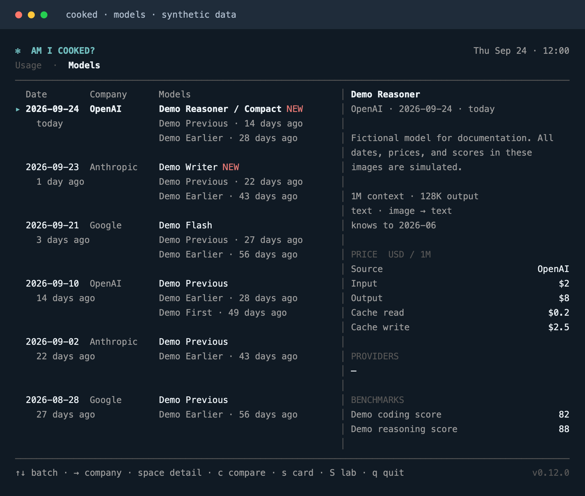
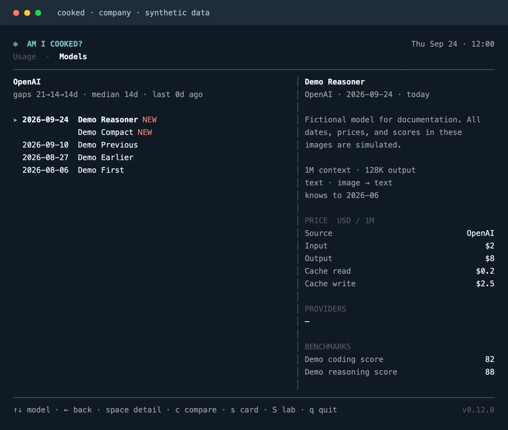
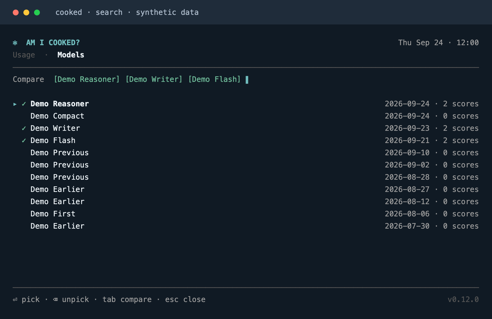
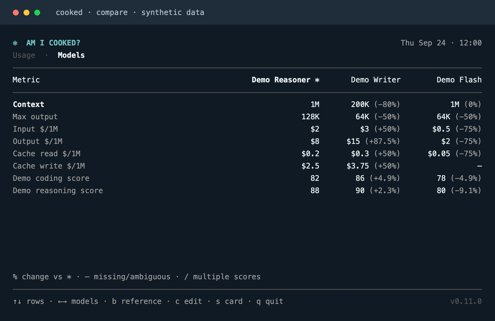
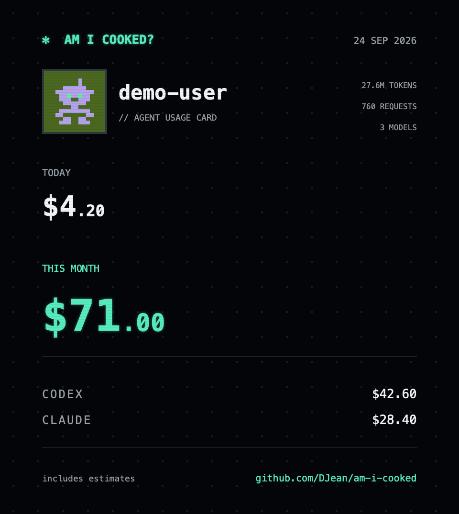
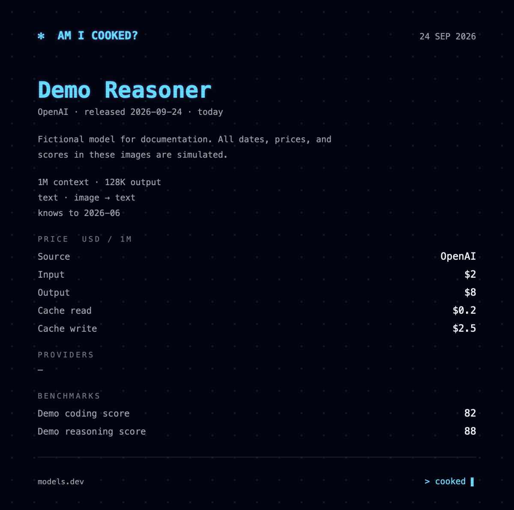
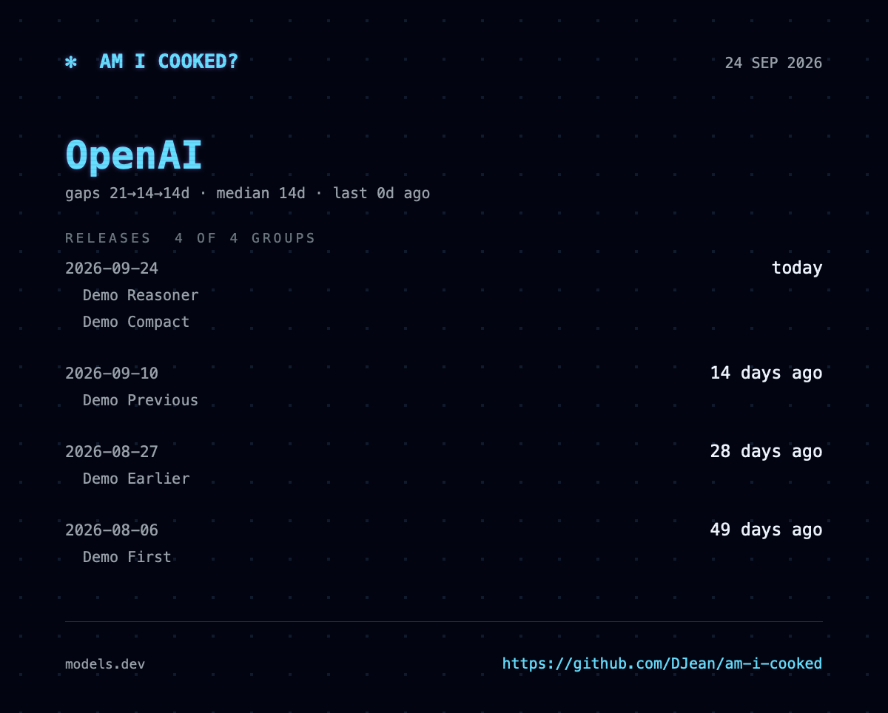
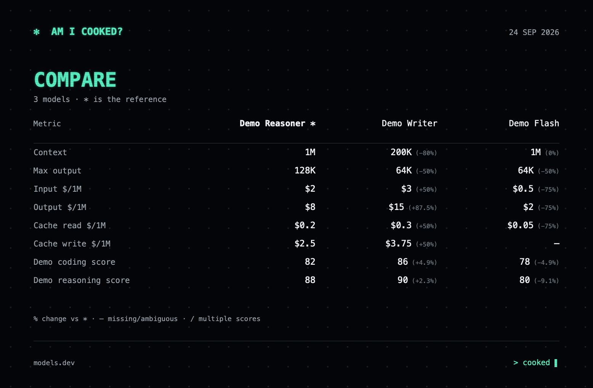

# cooked

一个轻量的 macOS 终端应用，用来查看 AI 编程工具用量和模型信息。

查看 **Codex、Claude Code、Cursor** 额度，估算本机 token 花费，浏览模型发布，比较价格和评测，并导出 PNG 卡片。使用 Swift 和系统框架，没有第三方包依赖。

[English](README.md) · [MIT 许可证](LICENSE) · [贡献指南](AGENTS.md)

## 预览

以下图片全部使用**模拟数据**：用量、模型名称、日期、价格和评测分数均为虚构。终端截图由应用的实际渲染器生成，再栅格化为图片；卡片由实际 PNG 导出器生成。它们仅演示界面，不代表当前价格或真实评测结果。

### Usage：用量

自动显示可用的数据源。没有对应安装痕迹时隐藏；检测到工具后，可以显示登录或网络错误。



<details>
<summary>展开后的模型花费明细</summary>



</details>

### Models：模型

浏览发布批次和模型详情；进入公司页查看模型列表及历史发布间隔。





### Compare：比较

搜索并选择模型，以指定模型为参考，比较上下文上限、价格以及评测条件一致的成绩。





### 导出

将用量、模型、公司和比较卡片保存到 Downloads。导出内容不受终端宽度或当前滚动位置限制。用量卡展示本机自然月估算，因此不包含 Cursor 的账期金额或团队金额。

<p>
  
  
  
  
</p>

## 安装与运行

需要 **macOS 13 或更新版本**，支持 Apple Silicon 和 Intel。Release 提供通用二进制，安装不需要 Swift 或 Xcode。

一行安装最新版本，无需 GitHub CLI 或登录 GitHub：

```sh
curl -fsSL https://github.com/DJean/am-i-cooked/releases/latest/download/install | sh
```

安装脚本下载最新稳定版本，验证 SHA-256 校验和及版本，然后原子安装到 `~/.local/bin/cooked`。如需单独安装，可用 `COOKED_INSTALL_DIR` 指定其他目录；自动更新仅限标准路径。将 `~/.local/bin` 加入 shell 的 `PATH`，或直接运行 `~/.local/bin/cooked`。Codex、Claude Code 和 Cursor 仍需在各自工具中登录，cooked 不执行这些登录。

```sh
cooked                             # 打开界面
cooked > usage.txt                 # 输出一次纯文本用量快照
NO_COLOR=1 cooked                  # 关闭终端颜色
cooked --version
cooked --help
```

如需从源码构建，安装 Swift 6 工具链（Xcode 16 或更新版本），克隆仓库后运行 `./install --source`，也可用 `swift run -c release cooked` 直接运行。

界面最多使用 104 列。Models 至少需要 80×21；Usage 所需高度取决于可见数据源和展开的明细。出现尺寸提示时，请调整终端大小。用量约每分钟刷新，公开模型数据约每 30 分钟刷新，失败后会更早重试。

## 操作

| 页面 | 按键 | 功能 |
| --- | --- | --- |
| 全局 | Ctrl+C | 退出 |
| Usage / Models | Tab、a、d | 切换标签页 |
| Usage / Models | q | 退出，搜索状态除外 |
| Usage | Space | 展开或收起模型花费明细 |
| Usage | s | 保存用量卡 |
| Models | ↑↓ 或 j/k | 选择发布批次或模型 |
| Models | → / ← 或 Esc | 进入公司页 / 返回时间线 |
| Models | Space | 详情翻页，到末尾后回到顶部 |
| Models | c | 打开比较搜索，预选当前模型 |
| Models | s / S | 保存模型卡 / 公司卡 |
| 搜索 | 输入文字、↑↓ | 筛选并选择结果 |
| 搜索 | Enter | 勾选或取消选择，并清空查询 |
| 搜索 | Backspace | 删除查询字符；查询为空时移除最后一个选择 |
| 搜索 | Ctrl+U / Esc | 清空查询 / 取消搜索 |
| 搜索 | Tab | 比较至少两个已选模型 |
| 比较 | ↑↓ / ←→ | 选择指标 / 滚动模型列 |
| 比较 | b | 切换参考模型 |
| 比较 | c 或 Esc | 编辑模型选择 |
| 比较 | s | 保存完整比较卡 |

除有不同导出含义的 `s` / `S` 外，字母快捷键也支持大写。搜索时，`q`、`s` 等字母均作为输入文字。

## 数据与隐私

cooked 没有遥测、账号服务或托管后端。凭证从本机只读获取，仅发送给对应服务的 API；不会自行登录、刷新 token 或改写凭证。服务凭证请求拒绝跨来源 HTTP 重定向。公开 Release 下载使用独立的 HTTPS 客户端，不使用服务凭证。获取的用量数据和解析缓存仅保留在内存中。

| 数据源 | 本机读取 | 远端查询 | 展示内容 |
| --- | --- | --- | --- |
| Codex | `$CODEX_HOME/auth.json` 和 `sessions/**/*.jsonl`，默认位于 `~/.codex` | `chatgpt.com/backend-api/wham/usage` | 配额窗口、工作区积分、本机花费估算 |
| Claude | Keychain 条目 `Claude Code-credentials`、`~/.claude.json`、`~/.claude/projects/**/*.jsonl` | `api.anthropic.com/api/oauth/usage` | 配额窗口、席位等级、本机花费估算 |
| Cursor | 以只读方式打开 `~/Library/Application Support/Cursor/User/globalStorage/state.vscdb` | `cursor.com/api/usage-summary` | 服务端额度、已用金额、账期重置时间 |

`~/.claude` 和 `~/.claude.json` 均不存在时隐藏 Claude；Cursor 数据库不存在时隐藏 Cursor；Codex 需要可用凭证或近期本机用量。首次读取 Claude 凭证时，macOS 可能请求 Keychain 授权。检测到 Claude/Cursor 安装但凭证缺失或失效时，会显示登录提示。临时故障保留本进程最近一次成功结果；429 响应遵循 `Retry-After` 退避。

会话文件在本机读取，仅解码用量相关字段，对话内容不会发送到任何地方。估算只覆盖**这台 Mac** 保留的日志，不涵盖所有设备。Claude 根据请求和消息 ID 避免重复计数。今天、本周（周一开始）、自然月按本地时区计算。价格缺失时保留 token 统计并提示估算不完整。按公开 API 价格计算的估算**不是订阅账单**。Codex 工作区积分不是美元；Cursor 账期及团队共享额度不是个人自然月花费，不加入本机花费合计。

Cursor 依次选择有效的个人总额度、团队共享额度、团队按量额度，最后兼容个人套餐额度。这只汇总接口返回的一个额度类别，不重建 Cursor 账单页面的全部额度。数据源接口和本地凭证格式没有公开文档，可能变化；无法识别的响应会提示错误，不当作零用量。模拟测试不能验证真实账号的接口兼容性。

以下公开数据源不需要凭证：

- [models.dev](https://models.dev)：模型元数据（`models.json`）、价格（`api.json`）和公司标志。作者价格按模型 ID 匹配；部署关联必须唯一明确。评测只在测量条件一致时比较。发布间隔是历史记录，不是未来预测。
- [LiteLLM 价格目录](https://github.com/BerriAI/litellm/blob/main/model_prices_and_context_window.json)：用于本机 token 花费估算，包括支持的缓存和长上下文价格档位。

程序不会将会话文件、获取的目录或凭证写入项目。主动导出时将 PNG 写入 Downloads，目录不存在则创建，遇到同名文件则添加数字后缀。用量卡默认使用中性名称 `cooked user`，不使用 macOS 登录名。分享前请检查卡片，其中的数值反映你的用量。所有卡片页脚均显示 `https://github.com/DJean/am-i-cooked`。


## 自动更新

交互运行时，启动及之后约每小时检查本仓库最新稳定 GitHub Release。只有安装在 `~/.local/bin/cooked` 的普通文件才会自动更新，且只接受更高的语义版本。替换前验证 Release tag、manifest、资产来源、SHA-256 和候选程序版本，然后原子替换。当前会话继续运行原版本，重新打开 cooked 后使用新版本。下载失败不会破坏已安装程序。

自动更新使用公开的 GitHub Releases，无需 GitHub CLI 或登录 GitHub。更新失败不影响正常使用。直接从源码目录运行（包括 `swift run`）、其他安装路径和符号链接安装不会被自动替换。`./install --source` 安装到标准路径的程序仍会更新；非交互快照不检查更新。

## 开发

```sh
swift test -Xswiftc -warnings-as-errors
swift build -c release -Xswiftc -warnings-as-errors
TZ=UTC COOKED_DOC_SCREENSHOTS=docs/images swift test --filter DocumentationScreenshotTests
```

默认测试使用临时目录、假凭证、注入的 HTTP 响应及模拟模型数据，不需要已登录账号。可选的公开数据格式测试通过 `COOKED_CATALOG_FIXTURES=/path/to/fixtures` 读取该目录下的 `models-dev-models.json` 和 `models-dev-api.json`；未设置时跳过。

- `Sources/Cooked`：终端输入、应用状态协调、刷新调度和导出操作。
- `Sources/CookedCore`：数据源、用量与花费模型、目录匹配、导航状态、纯终端渲染和原生 PNG 渲染。
- `Tests/CookedCoreTests`：解析、计算、故障处理、导航、终端尺寸、导出和发布检查。

两个 target 的结构是有意保留的简单边界。优先使用小型具体类型和可注入的 I/O，不引入插件框架或额外抽象层。[AGENTS.md](AGENTS.md) 记录了开发约定。

发布新版本时，修改 `Sources/CookedCore/UsageModels.swift` 中的 `Build.version`，重新生成受影响截图，提交更改后推送对应 tag：

```sh
git push origin main
git tag vX.Y.Z
git push origin vX.Y.Z
```

Release 工作流运行测试、构建 Apple Silicon + Intel 通用二进制、移除调试符号并进行 ad-hoc 签名，打包 `cooked`、`install`、`manifest.json` 和 `SHA256SUMS`，先上传完整资产到草稿 Release，再发布。每个版本保留在本仓库的 [Releases](https://github.com/DJean/am-i-cooked/releases)，不把二进制提交进 Git 历史。

`./release X.Y.Z` 在本地执行相同打包，输出到被忽略的 `dist/X.Y.Z/`；要求工作树干净，版本与 `Build.version` 一致，本身不上传。二进制经过 ad-hoc 签名，未经 Apple 公证。

## 许可证

[MIT](LICENSE)。运行时获取的服务数据、名称和标志仍受各自权利人的条款约束；代码许可证不会重新授予这些材料的使用权。
